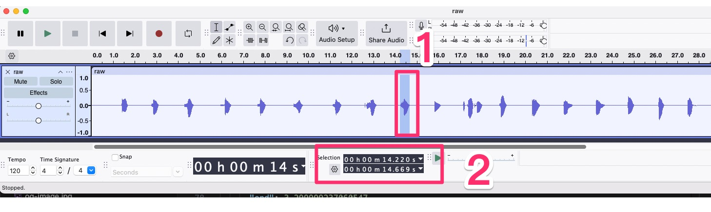

# Welcome to add any language with your own voice!

This project is designed for people who wants to learn languages with typing.

So we would like to have native speakers to contribute their own voice to help people learning the pronunciation.


## Setup local development environment

We use the node.js and yarn as the package management.

Make sure you have been installed it.

* Node.js
  * We recommend to use https://github.com/nvm-sh/nvm with you local development environment
* YARN
  * After node.js installed, you can just use following command command to install the yarn package management globally.
  * `npm install -g yarn`

### Install the dependencies and start the development server

To install the dependencies with yarn is very easy, just run `yarn` in the project directory. and give it few seconds to install.

Than you can start the development server with `yarn dev`

```
  vite v2.9.15 dev server running at:

  > Local: http://localhost:8001/
  > Network: use `--host` to expose

  ready in 99ms.
```

By default it will listen on 8001 on your localhost network interface.

After you open the link with web browser, make sure you are in the FreeTyping scene.


Now you can test the sounds by taping following letters on the bottom of the screen.


## Recording the pronunciation of alphabet with your own voice

We have Russian voice in this directory now.

```
/public/assets/voice/russian-alphabet
```

So you can put you own voice with your voice with this directory structure.


## Directory structure

In the voice directory, it contains at least two files ( For demo purposes, we use Russian here.)

### russian-alphabet.mp3

The file containing all the pronunciation of Russian alphabet. you can record your own voice with any recording application.

### russian-alphabet.json

The file contains the setting for every letters in the alphabet.

For example

``` json
{
  "spritemap": {
    "а": { // the key for the letter, must in lower case. and match to the keyboard.
      "start": 1.2, // When is the letter start pronunciation
      "end": 1.7400000095367432, // When is the letter end pronunciation
      "autoplay": false // Always false for this
    },
    "б": { 
      "start": 2.500000858306885,
      "end": 3.299999237060547,
      "autoplay": false
    },

    // .....гдеёжзийклмнопрстуфхцчшщъыьэ
  }
```

For now, the starting and ending timestamps are given form the AI analysis from the audio file above.

Sometimes the numbers are wrong, so we need human correction.

## Human Correction

We recommended to use Audacity to open the audio file that you recorded.

You can download the app from here https://www.audacityteam.org



After you use Audacity to open the audio file, you should seen something like the picture above.

First, you can drag to select the section you want to hear, than tap the Play button to make sure which letter are you hearing, if something sounds wrong, repeat this step until it sounds perfectly.

Second, check and remember the starting and ending timestamp on the screen. than back to the `russian-alphabet.json` to correct it.


Than you have to back to the browser to confirm the modification have been done perfectly.


And repeat those steps until every letters sounds perfectly.
